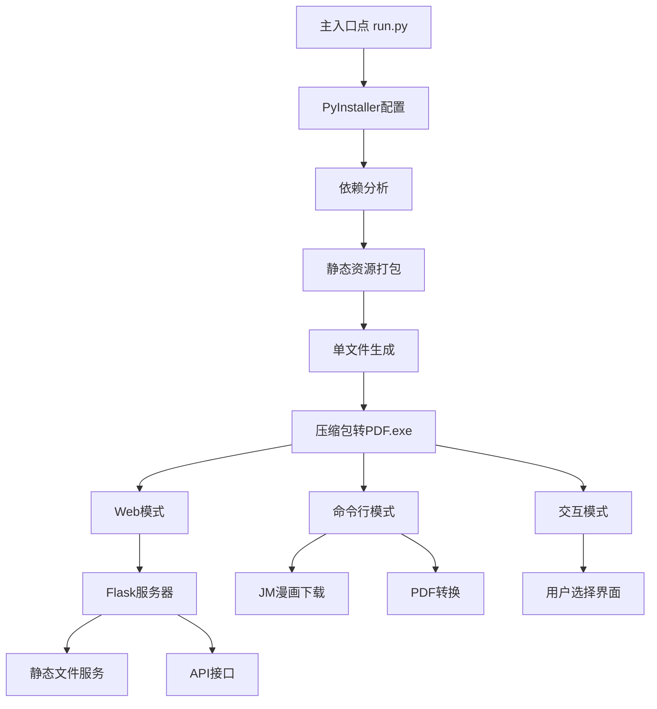

# Flask压缩包转PDF工具 - Windows单文件打包计划

## 项目概述
这是一个功能完整的Flask Web应用，具有Web界面和命令行模式，支持压缩包转PDF和JM漫画下载功能。

## 打包目标
- **平台**: Windows
- **格式**: 单文件可执行文件 (.exe)
- **功能**: 包含所有功能（Web界面 + 命令行 + JM漫画下载）

## 技术方案
使用PyInstaller进行打包，原因：
- 成熟稳定，最流行的Python打包工具
- 支持单文件模式
- 对Windows平台优化良好
- 自动处理Python依赖
- 可以打包静态资源文件

## 实施步骤

### 阶段1: 环境准备
1. 安装PyInstaller
2. 验证依赖完整性
3. 创建虚拟环境（可选）

### 阶段2: PyInstaller配置
1. 创建spec文件
2. 配置单文件模式
3. 包含静态资源（templates/, static/）
4. 处理特殊依赖

### 阶段3: 打包构建
1. 执行打包命令
2. 测试生成的可执行文件
3. 验证所有功能

### 阶段4: 优化和测试
1. 文件大小优化
2. 功能完整性测试
3. 错误处理验证

## 文件包含策略

### 必需包含的文件
- ✅ 所有Python源码文件 (.py)
- ✅ 静态资源 (templates/, static/)
- ✅ 配置文件 (config.py)
- ✅ 依赖包 (requirements.txt中的所有包)

### 运行时创建的目录
- 📁 uploads/ (上传文件)
- 📁 temp/ (临时解压)
- 📁 outputs/ (PDF输出)
- 📁 download/ (JM漫画下载)

## 技术架构



## 详细命令

### 打包命令
```bash
pyinstaller --onefile --name="压缩包转PDF工具" --add-data "templates;templates" --add-data "static;static" run.py
```

### 运行方式
```bash
# Web界面模式
压缩包转PDF工具.exe --web

# 命令行下载JM漫画
压缩包转PDF工具.exe 422866

# 交互模式
压缩包转PDF工具.exe
```

## 技术挑战和解决方案

| 挑战 | 解决方案 |
|------|----------|
| 静态资源打包 | 使用--add-data参数包含templates和static目录 |
| Flask模板加载 | 修改模板加载路径为临时解压目录 |
| 大文件处理 | 确保临时目录有足够空间 |
| 跨平台兼容性 | 针对Windows优化路径处理 |
| 依赖冲突 | 使用虚拟环境确保依赖版本一致 |

## 预计时间安排
- **环境配置**: 15分钟
- **打包配置**: 30分钟
- **构建测试**: 45分钟
- **优化完善**: 30分钟
- **总计**: 约2小时

## 风险控制
- 依赖问题: 使用虚拟环境隔离
- 文件大小: 优化依赖包选择
- 功能缺失: 全面测试所有功能
- 路径问题: 测试不同目录下的运行

## 最终交付物
- `压缩包转PDF工具.exe` (单文件可执行文件)
- 完整的测试报告
- 使用说明文档

---
**创建时间**: 2025-11-04 22:02
**状态**: 已批准