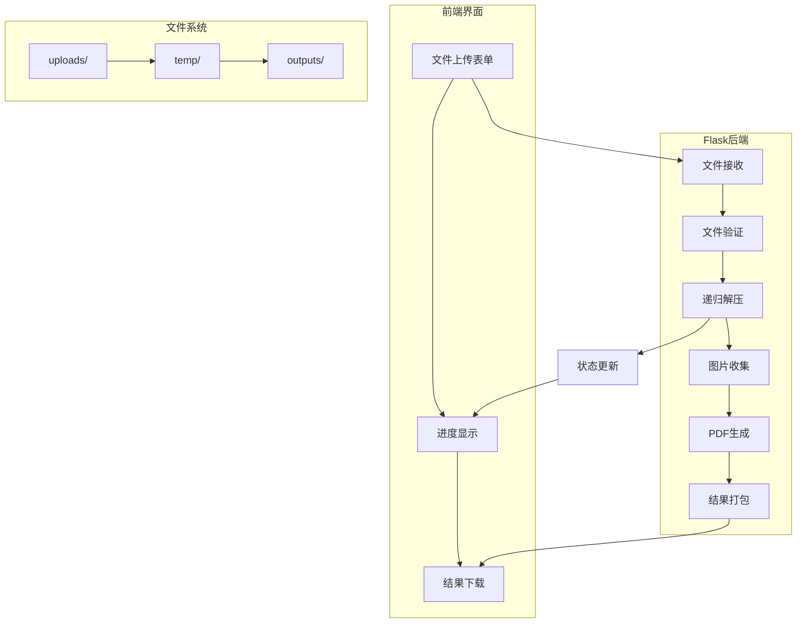

# Flask压缩包转PDF项目详细计划

## 项目概述
创建一个Python Flask Web应用，能够处理嵌套压缩包，提取其中的图片文件，并按文件夹分组生成A4竖排的PDF文件。

## 技术规格

### 技术栈
- **后端框架**: Python Flask
- **压缩包处理**: zipfile, tarfile, rarfile, py7zr
- **图片处理**: Pillow (PIL)
- **PDF生成**: img2pdf
- **文件类型检测**: python-magic
- **前端**: HTML5, CSS3, JavaScript (原生)
- **进度显示**: Server-Sent Events (SSE)

### 支持的文件格式
- **压缩格式**: .zip, .tar.gz, .tar.bz2, .rar, .7z
- **图片格式**: .webp, .jpg, .jpeg, .png, .gif, .bmp

## 项目架构

### 系统架构图


### 目录结构
```
zip_to_pdf_app/
├── app.py                    # Flask主应用
├── requirements.txt          # Python依赖包
├── config.py                # 配置文件
├── utils/                   # 工具模块
│   ├── __init__.py
│   ├── file_utils.py        # 文件处理工具
│   ├── compression.py       # 压缩包处理
│   ├── image_processor.py   # 图片处理
│   └── pdf_generator.py     # PDF生成
├── static/
│   ├── css/
│   │   └── style.css        # 样式文件
│   └── js/
│       └── main.js          # 前端JavaScript
├── templates/
│   └── index.html           # 主页面模板
├── uploads/                 # 上传文件临时存储
├── temp/                    # 解压临时目录
└── outputs/                 # 生成的PDF文件
```

## 核心功能模块详细设计

### 1. 文件上传模块 (app.py)
```python
# 主要功能：
- 接收multipart/form-data文件上传
- 文件大小验证（最大1GB）
- 文件类型验证（支持的压缩格式）
- 实时上传进度显示
- 文件存储到uploads目录
```

### 2. 递归解压模块 (utils/compression.py)
```python
# 主要功能：
- 自动检测压缩包格式
- 递归解压嵌套压缩包
- 保持原始目录结构
- 实时解压状态跟踪
- 临时文件管理
```

### 3. 图片处理模块 (utils/image_processor.py)
```python
# 主要功能：
- 图片文件识别和过滤
- 按文件名自然排序
- 图片格式转换（如webp转png）
- 图片质量优化
- 按文件夹分组图片
```

### 4. PDF生成模块 (utils/pdf_generator.py)
```python
# 主要功能：
- A4竖排页面设置
- 图片自适应页面大小
- 按文件夹生成多个PDF
- PDF文件命名和存储
- 生成结果打包
```

### 5. 前端界面模块
```html
<!-- 主要功能： -->
- 拖拽文件上传界面
- 实时进度条显示
- 解压状态实时更新
- 下载链接生成
- 响应式设计
```

## 详细实现步骤

### 阶段1: 项目基础设置 (预计时间: 1小时)
1. 创建项目目录结构
2. 配置requirements.txt依赖包
3. 设置Flask应用基础配置
4. 创建必要的目录结构

### 阶段2: 文件上传功能 (预计时间: 2小时)
1. 实现Flask文件上传路由
2. 添加文件验证逻辑
3. 实现上传进度显示
4. 测试文件上传功能

### 阶段3: 递归解压功能 (预计时间: 3小时)
1. 实现多种压缩格式支持
2. 开发递归解压算法
3. 添加解压状态跟踪
4. 测试嵌套压缩包处理

### 阶段4: 图片处理和PDF生成 (预计时间: 2小时)
1. 实现图片文件识别和排序
2. 开发PDF生成逻辑
3. 按文件夹分组处理
4. 测试PDF生成功能

### 阶段5: 前端界面开发 (预计时间: 2小时)
1. 创建用户友好的上传界面
2. 实现实时进度更新
3. 添加下载功能
4. 优化用户体验

### 阶段6: 集成测试和优化 (预计时间: 2小时)
1. 端到端功能测试
2. 性能优化和错误处理
3. 内存泄漏检查
4. 用户体验优化

## 关键算法设计

### 递归解压算法
```python
def recursive_extract(file_path, extract_to, status_callback):
    """
    递归解压压缩包
    """
    # 1. 检测文件类型
    # 2. 解压到临时目录
    # 3. 遍历解压后的文件
    # 4. 对每个文件检测是否为压缩包
    # 5. 如果是压缩包，递归调用
    # 6. 更新解压状态
```

### 图片收集和排序算法
```python
def collect_and_sort_images(root_dir):
    """
    收集并排序图片文件
    """
    # 1. 遍历目录结构
    # 2. 识别图片文件
    # 3. 按文件夹分组
    # 4. 按文件名自然排序
    # 5. 返回分组后的图片列表
```

## 配置要求

### 系统要求
- Python 3.8+
- 足够磁盘空间（至少2GB空闲）
- 内存：建议4GB+

### Python依赖包
```
Flask==2.3.3
Pillow==10.0.0
img2pdf==0.4.4
python-magic==0.4.27
rarfile==4.0
py7zr==0.20.4
```

## 测试计划

### 功能测试
1. 单层压缩包处理
2. 多层嵌套压缩包处理
3. 多种图片格式支持
4. 大文件处理（接近1GB）
5. 错误文件处理

### 性能测试
1. 解压速度测试
2. 内存使用监控
3. 并发处理测试
4. 磁盘空间管理

## 部署说明

### 本地开发运行
```bash
# 安装依赖
pip install -r requirements.txt

# 运行应用
python app.py
```

### 访问地址
http://localhost:5000

## 风险管理和应对措施

### 技术风险
1. **内存溢出**: 使用流式处理，及时清理临时文件
2. **文件损坏**: 添加文件验证和错误恢复机制
3. **格式不支持**: 提供清晰的错误提示信息

### 用户体验风险
1. **长时间等待**: 提供详细的进度信息
2. **操作复杂**: 简化界面设计，提供明确指引

## 成功标准
- 支持所有指定的压缩和图片格式
- 正确处理嵌套压缩包
- 按文件夹生成正确的PDF文件
- 提供良好的用户体验
- 稳定处理1GB以内的文件

这个计划涵盖了项目的所有关键方面，从技术实现到用户体验，确保项目能够成功交付。